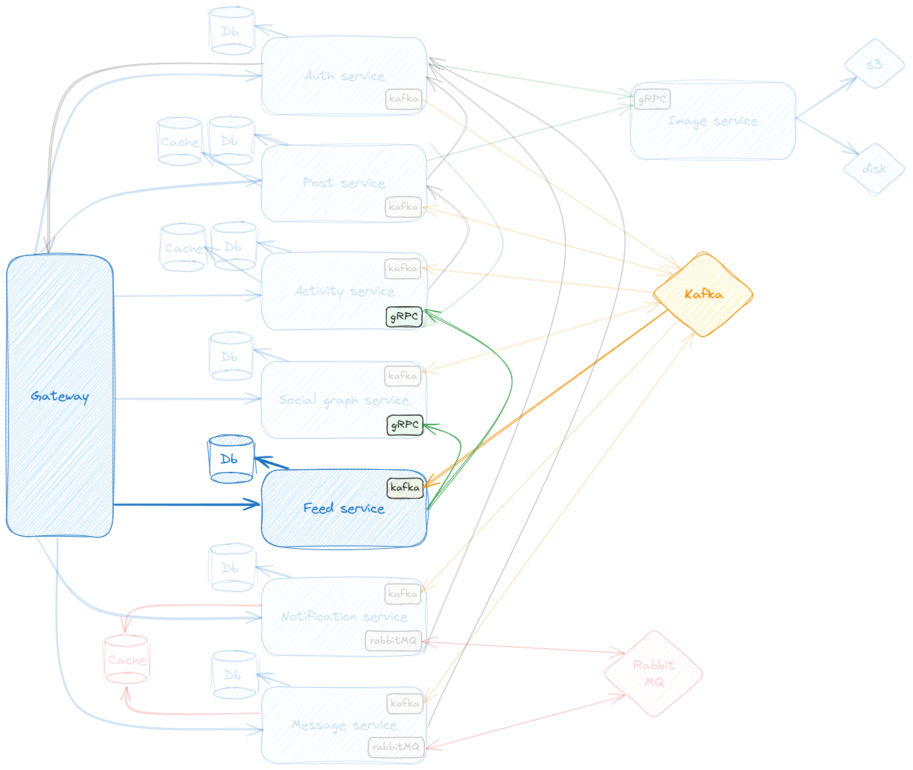

# Blossom


- [Overview](#overview)
- [How to run Blossom](#how-to-run-blossom)
- [Documentation](#documentation)

## Overview

Blossom is a fully functional social media network designed as a hands-on implementation of modern microservices and event-driven architecture principles. The goal was to simulate a scalable, distributed system capable of handling real-world social interactions - such as posting content, managing user profiles, following other users, real-time messaging and notifications.

## How to run Blossom

The easiest way to run Blossom is by deploying it using the docker-compose file.
For that there are a few prerequisites to install:
- [Git](https://git-scm.com/downloads)
- [Docker](https://docs.docker.com/desktop/)

Then you also need to clone this repository:

```git clone https://github.com/Bernardo-FMF/blossom.git```

In the root of the repository, create an .env file, and refer to the following table to define the necessary environment variables:

| Env variable name    | Description                                                                                 | Example                             |
|----------------------|---------------------------------------------------------------------------------------------|-------------------------------------|
| ROOT_USER_RELAY      | RabbitMQ username                                                                           | rootUserRelay                       |
| ROOT_PASSWORD_RELAY  | RabbitMQ password                                                                           | admin                               |
| ROOT_USER            | Username for database connections                                                           | rootUser                            |
| ROOT_PASSWORD        | Password for database connections                                                           | admin                               |
| S3_MOCK              | Determines if an AWS S3 bucket or the disk should be used ('true' corresponds to S3 bucket) | false                               |
| S3_REGION            | AWS S3 bucket region                                                                        | us-east-1                           |
| S3_BUCKET            | AWS S3 bucket name                                                                          | blossom                             |
| EMAIL_USERNAME       | The email that will be used to send emails to users                                         | email@email.com                     |
| EMAIL_PASSWORD       | The email password                                                                          | emailPassword                       |
| JWT_SECRET           | Secret to encrypt the JWT                                                                   | 111111111                           |
| JWT_DURATION         | TTL of the JWT in milliseconds                                                              | 86400000                            |
| JWT_REFRESH_DURATION | Refresh duration of the JWT in milliseconds                                                 | 604800000                           |
| CORS                 | CORS origin URL of the application client                                                   | http://localhost:3000               |
| VALIDATE_CALLBACK    | URL of the client that handles the email validation. This URL is received through email     | http://localhost:3000/auth/validate |
| RECOVER_CALLBACK     | URL of the client that handles the email recovery. This URL is received through email       | http://localhost:3000/auth/recover  |

Now the .env file should be in the same level as the docker-compose.yml file, all that is left is to run this file:

```docker-compose up ```

This requires docker to already be running.
If everything was set up correctly, all the containers should have been created. If there's a microservices that is down, simply restart it and it should work correctly.

## Documentation

Below is a brief introduction to all the microservices that are part of this project, their functionalities and how they relate to each other.

- [Docker containers](#docker-containers)
- [Configuration profiles](#configuration-profiles)
- [Architecture](#architecture)
- [Common utilities and gRPC contracts](#common-utilities-and-grpc-contracts)
- [Discovery server](#discovery-server)
- [Api gateway](#api-gateway)
- [Auth microservice and security practices](#auth-microservice-and-security-practices)
- [Image microservice](#image-microservice)
- [Post microservice](#post-microservice)
- [Activity microservice](#activity-microservice)
- [Social graph microservice](#social-graph-microservice)
- [Feed microservice](#feed-microservice)
- [Notification microservice](#notification-microservice)
- [Message microservice](#message-microservice)
- [Websockets and STOMP broker relay](#websockets-and-stomp-broker-relay)

### Docker containers

Each microservice contains a Dockerfile in its root folder, so they can be containerized locally if desired.

Additionally, this project uses websockets with STOMP enabled, so for that I created a [custom RabbitMQ image](https://github.com/Bernardo-FMF/blossom/tree/master/custom-docker-images) with the STOMP plugin enabled.

### Configuration profiles

Each microservice has 3 profiles:
- **Default**: Contains the necessary variables to run the microservice, ranging from the port it runs on to database configuration, among others.
- **Docker**: Uses all the default profile variables but for the discovery server it points to the container hostname instead of localhost.
- **Kubernetes**: Kubernetes deployment files were momentarily removed from this project - will be added in the future.

### Architecture


Here we can see the full workflow of the application, and the different dependencies between each microservice.
In the next sections, I will go more in-depth regarding each microservice.

### [Common utilities](https://github.com/Bernardo-FMF/blossom/tree/master/common-utilities) and [gRPC contracts](https://github.com/Bernardo-FMF/blossom/tree/master/grpc-interface)

These modules contain common utilities and contracts used all throughout the project.
Here I defined the gRPC contracts and models, API facades for example to define gRPC servers and clients, the model utilized for kafka messages, and some security utilities.

### [Discovery server](https://github.com/Bernardo-FMF/blossom/tree/master/discovery-server)

Server used to register all microservices included in this project. In this case, using [Netflix Eureka](https://cloud.spring.io/spring-cloud-netflix/reference/html/)
each client can simultaneously act as a server, to replicate its status to a connected peer. In other words, a client retrieves a list of all connected
peers of a service registry and makes all further requests to any other services through a load-balancing algorithm (Ribbon by default).

### [Api gateway](https://github.com/Bernardo-FMF/blossom/tree/master/api-gateway)

Using [Spring Gateway](https://docs.spring.io/spring-cloud-gateway/docs/current/reference/html), this is the entry point of the application.
Here, we can route the requests to the correct microservice, and can even validate if the request should reach its destination, based on if it's a protected route or not.
It also validates JWT, and creates headers that each microservice uses to identify the logged user.

### [Auth microservice](https://github.com/Bernardo-FMF/blossom/tree/master/auth-service) and security practices


The auth microservice handles all authentication and authorization flows of the application.
#### &#10022;Features&#10022;
- User registration;
- User login;
- User logout (specific session or all sessions);
- Email verification;
- Email change;
- Password change;
- JWT validation and refresh;
- Enable and disable MFA, and also MFA code validation;
- Delete account;
- Profile image change;
- User search;

Notes:
- All requests that sent to the gateway that require the user to be authenticated, will send a request to the auth microservice to validate the JWT.
- If a user has MFA enabled and tries to login, the response will only be the user model. The client needs to check a flag of that model to know if MFA is enabled and so to obtain a JWT, a new request needs to be sent to validate the MFA code using the chosen application for authentication. 
- When a user is created, a kafka message is propagated to the different microservices that require this information, as shown in the above diagram.

### [Image microservice](https://github.com/Bernardo-FMF/blossom/tree/master/image-service)


The image microservice exposes a gRPC server that handles the upload and delete of images.
It's an internal microservice used by the auth and post microservices.

- The image upload is handled using a client streaming RPC, where the client sends blocks of bytes that compose the image instead of the full image in one go. When the client completes the streaming and the server finishes writing the image, the server generates the identifier of that image which is just the URL the client can use to access the image.
  - There are 2 ways that images are stored, depending on the environment configuration:
    - AWS S3 bucket;
    - Disk;
- The image delete is handled using a unary RPC using the previously mentioned identifier to delete the image from the S3 bucket or from disk.

### [Post microservice](https://github.com/Bernardo-FMF/blossom/tree/master/post-service)


The post microservice handles all content created by users.

#### &#10022;Features&#10022;
- Post creation;
- Post delete;
- Find specific post;
- Find posts by user;
- Search posts by hashtag;

Kafka messages related to users are propagated to this microservice, storing the users in a Redis cache instance. If the user is not present in cache, a REST request is done to the auth service to try and find that specific user.
Like the auth microservice, here we also access the gRPC server in the image microservice, since posts can have image content.
Whenever a post is created or deleted, a kafka message is sent from this microservice.

### [Activity microservice](https://github.com/Bernardo-FMF/blossom/tree/master/activity-service)


The activity microservice handles data related to posts: comments, likes and saves.

#### &#10022;Features&#10022;
- Add, delete and update comments;
- Nested comment system;
- Save, like, remove save and remove likes on posts;
- Obtain metadata on a post: if the logged user liked it, saved it, commented it, number of likes and number of comments;

Kafka messages related to CRUD operations on users and posts are propagated to this microservice:
- Users are persisted on the database;
- Posts are stored on a Redis cache instance;
User data availability is more important, hence the persistence, while posts are less accessed so a cache fits the microservices needs. If the post is not available in the cache a REST request is done to the post microservice to fetch it.

The microservice also exposes a gRPC server, to get metadata related to a list of posts.

### [Social graph microservice](https://github.com/Bernardo-FMF/blossom/tree/master/social-graph-service)


The social graph microservice handles relationships between users by leveraging a graph database.
These relationships can be unidirectional or bidirectional, since users can be mutually following each other, or just user A following user B.

#### &#10022;Features&#10022;
- Follow user;
- Unfollow user;
- Find follow information about how other users are related to the logged user;
- Get logged user followers;
- Get users the logged user is following;
- Get follow recommendations;

The recommendation algorithm is only using a single-depth search. This means if user A is following users B and C, the follow recommendations given to user A will be people that users B and C are following.
The auth microservice user kafka messages are also propagated to this microservice, since the database needs to have accurate information regarding available users.

### [Feed microservice](https://github.com/Bernardo-FMF/blossom/tree/master/feed-service)



The feed microservice generates user feeds consisting of posts.

#### &#10022;Features&#10022;
- Generate user feed;

Whenever a CRUD operation is performed on a post, a kafka message is propagated. The feed microservice reads this message, and acts accordingly:
- If the post was created, we need to fetch a list of users that follow the creator of the post, and we add this new post to those followers feeds.
- If the post was deleted, we remove that post from every feed.

There are 2 types of feeds: feeds for authenticated users, and a generic feed.
- For authenticated users, the logic explained above applies.
- For the generic feed, I obtain a list of the most followed users, and obtain their most recent posts to display.

Each post model reported by the feed microservice, contains metadata relating the logged user to that specific post. This metadata is obtained from the activity microservice by doing an RPC call.

### [Notification microservice](https://github.com/Bernardo-FMF/blossom/tree/master/notification-service)


The notification microservice stores notifications related to follows and messages:
- When a user is followed by a different user, the social graph microservice propagates a kafka message to represent that event. The notification microservice intercepts that message, and tries to send it to the user.
  - If the user has an open websocket connection, we send that follow notification directly;
  - Otherwise, it's stored to the database. At this point, it will only be received by the recipient when the client performs a REST request to obtain undelivered notifications.
- When a user sends a message to a chat, the message microservice propagates a kafka message to represent that event.
  - At this point, we only store the message notification to the database. This is because if the recipient had an open websocket connection, the message microservice would've already sent the message through it, instead of sending this kafka message.

The notifications must be acknowledged by the client through a REST request. Only this way will the specific notification be marked as delivered in the database. They are not deleted to preserve notification history.

### [Message microservice](https://github.com/Bernardo-FMF/blossom/tree/master/message-service)


The message microservice stores chats and messages between users.

#### &#10022;Features&#10022;
- Create, delete and leave chats;
- Get user chats;
- Add and remove users from chats;
- Send, update and delete messages;

We use websockets to have real-time messaging.

- Chat operation flow:
  - When a user performs an operation on a chat (the user created a chat for example), a message is sent through the websocket if the recipient has an open websocket connection.
  - Otherwise, a kafka message is sent to the notification microservice to be delivered later.
- Messages flow:
  - Initially the client fetches all the chats messages through a REST request.
  - The messages sent afterward are all sent and received through the websocket connections of the users.
  - If the recipients have an active websocket connection, the messages are received in real-time.
  - Otherwise, a kafka message is sent to the notification microservice, as explained in the notification microservice section.

### Websockets and STOMP Broker relay

As documented previously, the notification and message microservices use websockets to communicate with the client.
But when there are multiple instances of these microservices, we encounter an issue:
- What if the user 1 has an open websocket connection in message microservice A but user 2 has an open websocket connection in message microservice B?

In this scenario the message will not be delivered in real-time, therefore I needed a way to maintain coordination between microservice instances.

To ensure real-time delivery across all instances, I used RabbitMQ with STOMP enabled as a message broker.
Each instance subscribes to relevant events, allowing them to relay messages to connected clients regardless of which instance the message originated from.